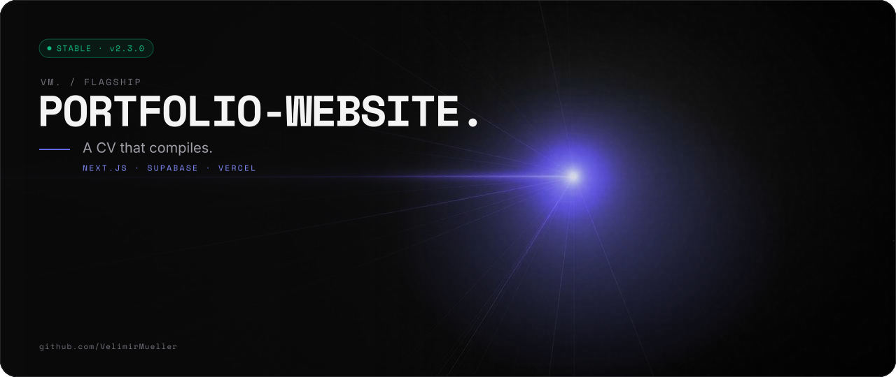
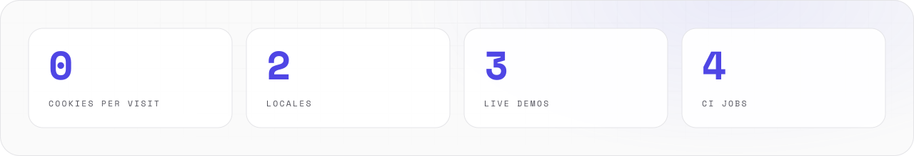
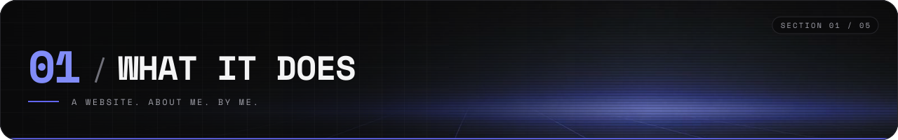
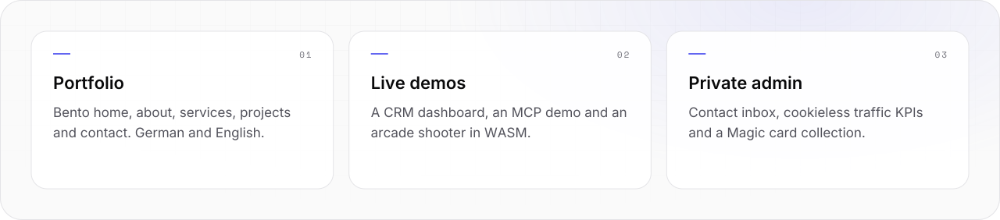
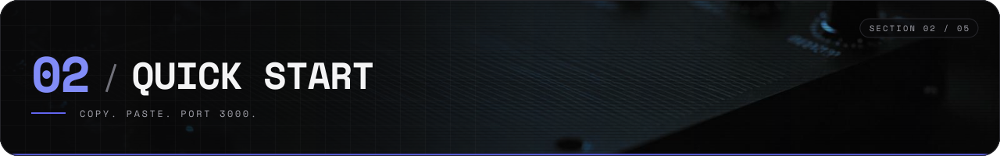
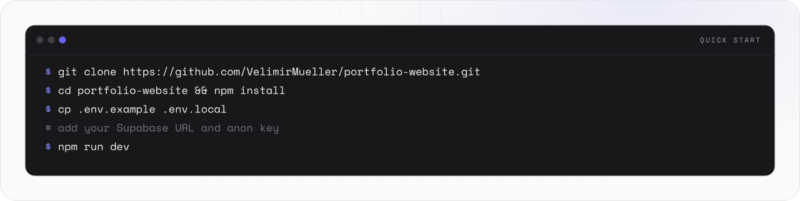
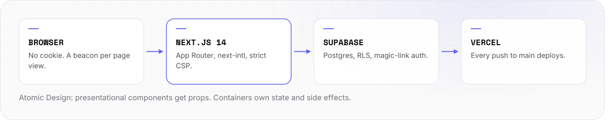
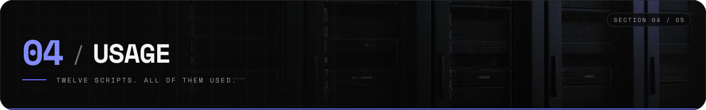
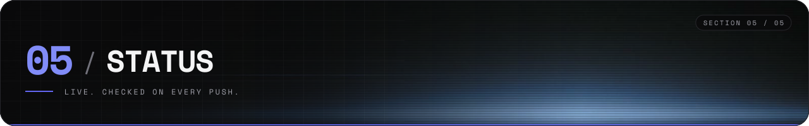
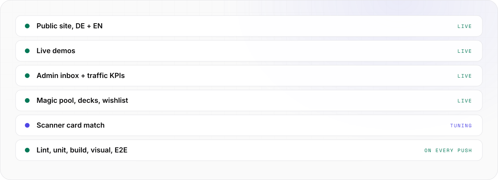

<picture>
  <source media="(prefers-color-scheme: light)" srcset="assets/banner/hero-v2-light.svg">
  
</picture>

<p align="center">

[](https://www.velimir-mueller.de) [](https://github.com/VelimirMueller) [](package.json) [](https://nextjs.org)

</p>

> A CV that compiles.

```text
█████    ████   █████   ██████  ██████   ████   ██      ██████   ████
██  ██  ██  ██  ██  ██    ██    ██      ██  ██  ██        ██    ██  ██
█████   ██  ██  █████     ██    █████   ██  ██  ██        ██    ██  ██  █████
██      ██  ██  ██ ██     ██    ██      ██  ██  ██        ██    ██  ██
██       ████   ██  ██    ██    ██       ████   ██████  ██████   ████

██   ██  ██████  █████    █████  ██████  ██████  ██████
██   ██  ██      ██  ██  ██        ██      ██    ██
██ █ ██  █████   █████    ████     ██      ██    █████
███████  ██      ██  ██      ██    ██      ██    ██
 ██ ██   ██████  █████   █████   ██████    ██    ██████  ██
```

The source of [www.velimir-mueller.de](https://www.velimir-mueller.de): portfolio, services and live demos, plus a private admin.
It sets no cookies. It still remembers your language, for the length of one URL.

<picture>
  <source media="(prefers-color-scheme: dark)" srcset="assets/readme/stats-v2-dark.svg">
  
</picture>

<br>

## // 01 WHAT IT DOES



<picture>
  <source media="(prefers-color-scheme: dark)" srcset="assets/readme/features-v2-dark.svg">
  
</picture>

- Shows end-to-end product engineering: requirements, UX/UI, full-stack code, automated deployment.
- Serves German and English. A visit sets no cookie, so the site needs no consent banner.
- Runs three live demos: a CRM dashboard, an MCP demo and an arcade shooter in WASM.
- Gives one admin a private area at `/admin`: contact inbox, cookieless traffic KPIs and a Magic: The Gathering collection.

<br>

## // 02 QUICK START



<picture>
  <source media="(prefers-color-scheme: dark)" srcset="assets/readme/start-v2-dark.svg">
  
</picture>

```bash
# Clone the repository
git clone https://github.com/VelimirMueller/portfolio-website.git
cd portfolio-website

# Install dependencies
npm install

# Set up environment variables
cp .env.example .env.local
# → Add your Supabase URL and anon key to .env.local

# Start the dev server
npm run dev
```

- Open **[localhost:3000](http://localhost:3000)** to view the app.
- Under `next dev` the CSP blocks `eval`. Client components (counters, keyboard shortcuts) do not hydrate locally. Check interactive behaviour with `npm run build && npm start`.

<br>

## // 03 HOW IT WORKS


<picture>
  <source media="(prefers-color-scheme: dark)" srcset="assets/readme/flow-v2-dark.svg">
  
</picture>

```text
┌─ components/ ──────────────┐      ┌─ containers/ ──────────────┐
│ atoms → molecules →        │ ◄─── │ state, side effects, API   │
│ organisms → templates      │ props│ Supabase via utils/        │
│ no business logic          │      │   server.ts · client.ts    │
└────────────────────────────┘      └────────────────────────────┘
```

- **Stack:** Next.js 14 (App Router), TypeScript (strict), Tailwind CSS, Supabase, Vercel. Tests: Jest, React Testing Library, Playwright. AI tooling: Claude AI.
- **Design:** monochrome + accent, full dark mode. Bento grid with `rounded-[1.5rem]` cards, monospace labels and data, subtle grid backgrounds and blur gradients, hover micro-animations, green pulse indicators for availability.
- **No cookies.** `next-intl` runs with `localeCookie: false`. `e2e/headers.spec.ts` asserts that public pages set no cookie. hCaptcha loads only when the contact form is sent.
- Full source tree and the page list: [docs/REFERENCE.md](docs/REFERENCE.md#architecture).

<br>

## // 04 USAGE



### Scripts

- `npm run dev`: start the development server.
- `npm run build`: production build. `npm run start`: serve the production build.
- `npm run lint`: ESLint check. `npm run type-check`: TypeScript type check (no emit).
- `npm test`: Jest unit tests. `npm run test:watch`: watch mode. `npm run test:coverage`: coverage report.
- `npm run storybook`: Storybook on port 6006. `npm run build-storybook`: static Storybook site.
- `npm run test:visual`: Playwright visual regression tests. `npm run test:e2e`: Playwright E2E tests.

### Testing

Unit and integration tests use Jest with React Testing Library.

```bash
npm test                  # Run all tests
npm run test:watch        # Watch mode
npm run test:coverage     # Generate coverage report
```

Visual regression: Playwright screenshots every Storybook story and compares it with the baseline.
Config `playwright-storybook.config.ts`, tests `e2e/storybook-visual.spec.ts`.

```bash
npm run test:visual -- --update-snapshots   # Generate baselines
npm run test:visual                          # Run comparison
```

End-to-end: [Playwright](https://playwright.dev/) against the production build. It covers navigation, theme/language toggle, contact form, service pages, project demos and 404 handling.
Config `playwright.config.ts`, tests `e2e/app.spec.ts`.

```bash
npm run test:e2e                        # Run all E2E tests
npm run test:e2e -- --grep "Navigation" # Run specific tests
```

### Storybook

[Storybook 8](https://storybook.js.org/) is the component library and the visual documentation.

```bash
npm run storybook   # → localhost:6006
```

- **Atoms:** Button, CodeBlock, LanguageToggle. **Molecules:** BentoCard, SectionHeader. **Organisms:** Navigation, Footer.
- Autodocs, controls panel, dark/light toolbar toggle, responsive viewport presets, accessibility (a11y) audit panel.

### Commit convention

Commits follow [Conventional Commits](https://www.conventionalcommits.org/). A husky `commit-msg` hook runs commitlint. The `prepare` script installs the hook on `npm install`.

```
type(scope?): subject

feat(contact): add honeypot field
fix(theme): honor system light preference
chore(release): v2.0.0
```

Common types: `feat`, `fix`, `chore`, `docs`, `test`, `refactor`, `perf`, `ci`.

### Admin

- Private area at `/admin` since **v2.0.0**: contact inbox, traffic KPIs (v2.1.0), Magic (v2.2.0). English only, `noindex`, disallowed in `robots.txt`.
- Access: Supabase Auth magic link for one admin user. Middleware, `requireAdmin()` and Postgres RLS via `public.is_admin()` check it. No service-role key.
- The admin's user UUID lives in `src/config/admin.ts` **and** in the migration. Change both together.
- Migrations live in `supabase/migrations/`. Apply them in the Supabase SQL editor.
- Analytics needs `ANALYTICS_INGEST_SECRET` in Vercel. The Magic catalog loader needs `SUPABASE_DB_URL`.
- Every table, setup step, keyboard shortcut and Supabase Auth setting: [docs/REFERENCE.md](docs/REFERENCE.md#admin-v2).

### Deployment

Vercel is connected through GitHub. Every push to `main` triggers a production deployment.

Required environment variables (set in the Vercel dashboard):

```
NEXT_PUBLIC_SUPABASE_URL
NEXT_PUBLIC_SUPABASE_PUBLISHABLE_DEFAULT_KEY
```

The contact form also reads `RESEND_API_KEY`, `NEXT_PUBLIC_HCAPTCHA_SITEKEY` and `HCAPTCHA_SECRET` (see `.env.example`).

<br>

## // 05 STATUS



<picture>
  <source media="(prefers-color-scheme: dark)" srcset="assets/readme/status-v2-dark.svg">
  
</picture>

- [GitHub Actions](https://github.com/VelimirMueller/portfolio-website/actions) (`.github/workflows/ci.yml`) runs on every push and PR to `main`.
- Jobs: lint & type check (ESLint + `tsc --noEmit`), unit tests with coverage + Next.js build, Storybook build + visual regression, E2E against the production build.
- Run the same locally: `npm run lint && npm run type-check && npm test && npm run test:e2e`.
- Contact: [LinkedIn](https://www.linkedin.com/in/velimir-m%C3%BCller-07b460175) · [Email](mailto:velimir.mueller@googlemail.com) · [GitHub](https://github.com/VelimirMueller).

<br>

```text
-- EOF ---------------------------------------- NO COOKIES WERE SET --
```

---

<sub>VM. studio / flagship · source available, all rights reserved · look per <code>vm-brand</code> playbook</sub>
